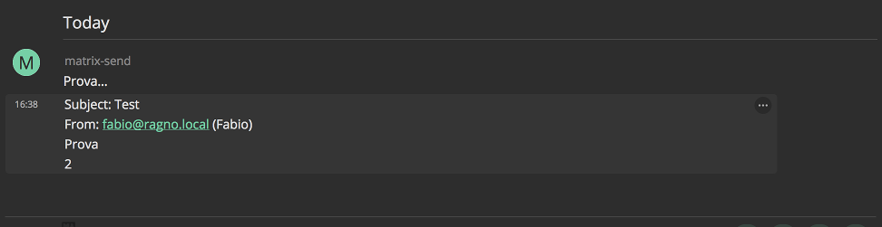

# Matrix Send

*Send mail to Matrix room*

## How

Copy `config.dist.py` to `config.py`.

Set username, password and the room to send mails in `config.py`

Add alias to `/etc/aliases`:

    localuser: |/path/to/matrix-send-queue-mail.py

Run `matrix-send-server.py`

Test:

    $ mail localuser
    Subject: Test
    Prova
    2
    .
    $

